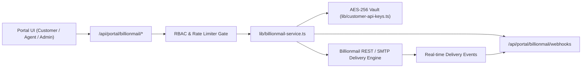

# Billionmail Integration Architecture & API Reference

## 1. Overview
Billionmail is DealFlow.AI's autonomous outbound email and campaign delivery engine. It enables automated, high-velocity email delivery, audience synchronization, template personalization, and real-time delivery telemetry (open tracking, click tracking, bounce mitigation, and spam complaint monitoring).

---

## 2. Architecture & Data Flow



---

## 3. Core Capabilities
- **Campaign Management**: Creation, updating, scheduling, and instant dispatching of segmented email broadcasts.
- **Audience & Contact Sync**: Ingest single contacts or batch lists with custom metadata, tags, and subscription statuses.
- **Template Personalization Engine**: Dynamic string interpolation supporting variables like `{{firstName}}`, `{{company}}`, `{{title}}`.
- **Live Event Ticker & Webhooks**: Ingestion pipeline for `delivered`, `opened`, `clicked`, `bounced`, `spam_report`, and `unsubscribed` events.
- **Analytics & Health Telemetry**: Aggregated conversion funnel calculations (Delivery Rate, Open Rate, CTR, Bounce Rate) and 7-day volume time-series charts.

---

## 4. API Endpoints Reference

### 4.1 Campaigns API (`/api/portal/billionmail/campaigns`)
- **`GET /api/portal/billionmail/campaigns`**
  - Query parameters: `status` (`completed` | `sending` | `scheduled` | `draft`), `search` (keyword)
  - Returns: `{ success: true, campaigns: BillionmailCampaign[] }`
- **`POST /api/portal/billionmail/campaigns`**
  - Payload:
    ```json
    {
      "title": "Q3 Enterprise Outreach",
      "subject": "Accelerating {{company}} with DealFlow",
      "senderName": "DealFlow Outbound",
      "senderEmail": "growth@dealflows.ai",
      "audienceName": "Enterprise Decision Makers",
      "contentHtml": "<p>Hello {{firstName}}...</p>",
      "sendImmediately": true
    }
    ```
  - Returns: `{ success: true, campaign: BillionmailCampaign }` (Status 201)
- **`DELETE /api/portal/billionmail/campaigns?id=bm-camp-xxx`**
  - Returns: `{ success: true, deleted: true }`

### 4.2 Audience & Contacts API (`/api/portal/billionmail/contacts`)
- **`GET /api/portal/billionmail/contacts`**
  - Query parameters: `listId`, `tag`, `search`
  - Returns: `{ success: true, count: number, contacts: BillionmailContact[] }`
- **`POST /api/portal/billionmail/contacts`**
  - Payload:
    ```json
    {
      "contacts": [
        {
          "email": "sarah.connor@cyberdyne.io",
          "firstName": "Sarah",
          "lastName": "Connor",
          "company": "Cyberdyne Systems",
          "tags": ["enterprise", "gtm"]
        }
      ]
    }
    ```
  - Returns: `{ success: true, syncedCount: number, contacts: BillionmailContact[] }`

### 4.3 Analytics Telemetry API (`/api/portal/billionmail/analytics`)
- **`GET /api/portal/billionmail/analytics`**
  - Returns: `{ success: true, analytics: BillionmailAnalytics }`

### 4.4 Webhook Ingestion API (`/api/portal/billionmail/webhooks`)
- **`POST /api/portal/billionmail/webhooks`**
  - Payload:
    ```json
    {
      "event": "opened",
      "campaignId": "bm-camp-901",
      "email": "alex.mercer@gentek-ai.com",
      "details": "Opened on macOS Mail"
    }
    ```
  - Returns: `{ success: true, eventId: "ev-xxx" }`

---

## 5. Security & Credentials
- All Billionmail API keys (`bm_...` or `billion_...`) are encrypted at rest using AES-256 via the DealFlow Secrets Vault (`lib/customer-api-keys.ts`).
- Access to campaign dispatching and audience sync is protected by Portal RBAC session verification.
