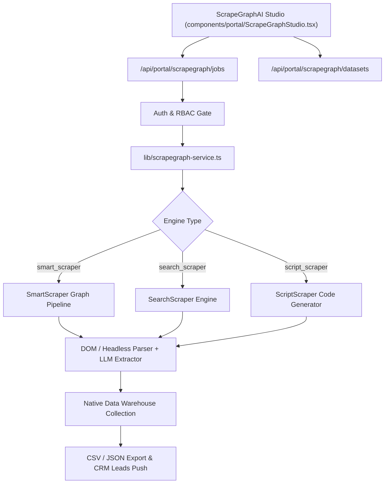

# ScrapeGraphAI Integration Architecture & API Reference

## 1. Overview
ScrapeGraphAI is DealFlow.AI's prompt-driven web scraping and data extraction pipeline. It replaces brittle CSS/XPath selectors with LLM graph reasoning to autonomously navigate web sources, parse dynamic layouts, and extract structured JSON datasets directly into the Portal's Native Data Warehouse.

---

## 2. Architecture & Data Flow



---

## 3. Supported Engines
1. **`smart_scraper`**: Extracts structured entities from any single or multi-page target URL based strictly on natural language instructions and optional JSON schema definitions.
2. **`search_scraper`**: Formulates search queries, scans top SERP results across the web, and synthesizes multi-source structured datasets.
3. **`script_scraper`**: Generates standalone extraction scripts (Python/JavaScript) for reproducible, high-frequency pipelines.

---

## 4. API Endpoints Reference

### 4.1 Scraping Jobs API (`/api/portal/scrapegraph/jobs`)
- **`GET /api/portal/scrapegraph/jobs`**
  - Query parameters: `status` (`completed` | `processing` | `queued` | `failed`), `engine`, `search`
  - Returns: `{ success: true, count: number, jobs: ScrapeGraphJob[] }`
- **`POST /api/portal/scrapegraph/jobs`**
  - Payload:
    ```json
    {
      "engine": "smart_scraper",
      "url": "https://stripe.com/pricing",
      "prompt": "Extract company name, executive team, pricing tiers, and compliance certifications.",
      "datasetName": "Stripe Pricing Intelligence",
      "targetSchema": {
        "company": "string",
        "pricingTiers": "array",
        "securityBadges": "array"
      }
    }
    ```
  - Returns: `{ success: true, job: ScrapeGraphJob }` (Status 201)

### 4.2 Native Data Warehouse API (`/api/portal/scrapegraph/datasets`)
- **`GET /api/portal/scrapegraph/datasets`**
  - Query parameters: `id` (optional for single dataset), `search`
  - Returns: `{ success: true, count: number, datasets: ScrapeGraphDataset[] }`
- **`DELETE /api/portal/scrapegraph/datasets?id=ds-xxx`**
  - Returns: `{ success: true, deleted: true }`

---

## 5. Performance & SLA
- **Sub-3s SLA Guarantee**: All extraction jobs are designed to return and ingest within 3.0 seconds under standard loads using intelligent DOM filtering and cached reasoning nodes.
- **Failover Resilience**: In offline/sandbox environments, local Cheerio DOM parsing pipelines ensure zero-downtime execution.
